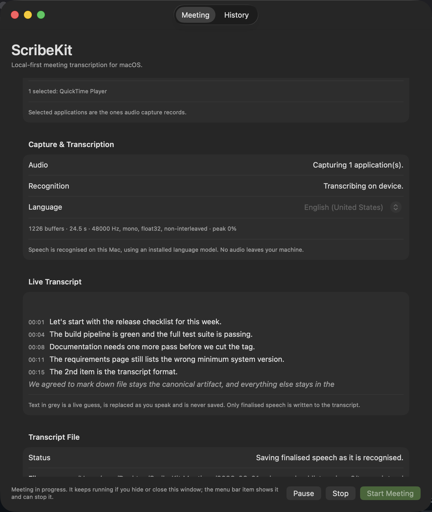
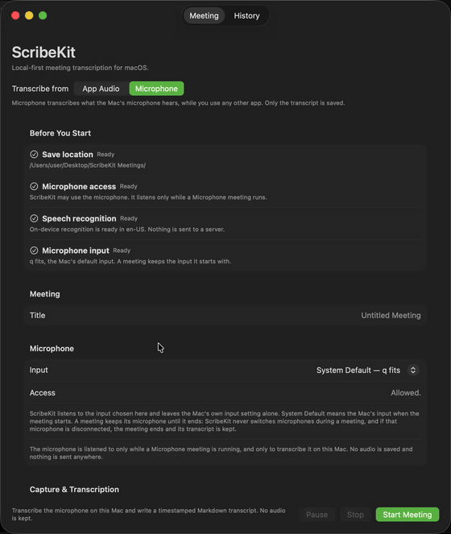
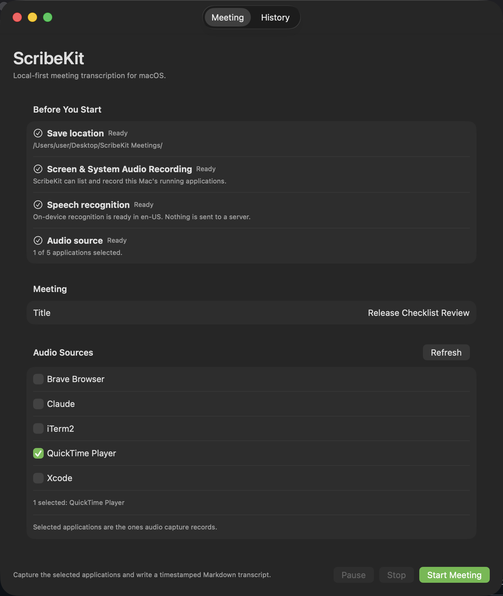
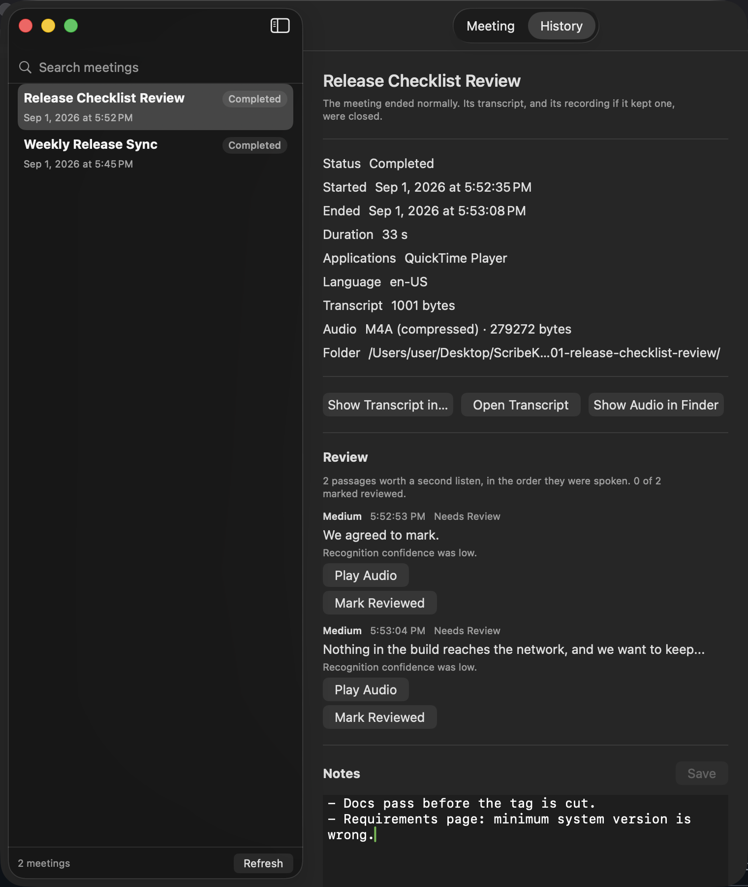

<p align="center">
  
</p>

<h1 align="center">ScribeKit</h1>

<p align="center">
  <strong>Native macOS meeting transcription.</strong><br>
  Capture the applications you pick, transcribe on your Mac, keep a Markdown transcript you own.
</p>

<p align="center">
  <a href="https://github.com/quangshuynh/scribekit/actions/workflows/ci.yml"></a>
  <a href="https://github.com/quangshuynh/scribekit/actions/workflows/docs.yml"></a>
  <a href="https://swift.org"></a>
  <a href="https://www.apple.com/macos/"></a>
  <a href="LICENSE"></a>
</p>

> ### Status: v0.1.0 release candidate — source only
>
> ScribeKit is feature-frozen for its first release. **There is no prebuilt
> signed or notarized download.** v0.1.0 ships as source, and you
> [build it yourself](#build-from-source). Nothing about that is a network
> requirement: ScribeKit runs entirely on your Mac either way.

<p align="center">
  
</p>

ScribeKit runs quietly while you work in other applications. You pick which
applications it listens to, it recognises the speech on this Mac with Apple's
on-device speech models, and it appends a timestamped Markdown transcript into
a folder you chose — readable in any editor while the meeting is still running.

## Demo

Selecting an application, starting a meeting, live transcription, pause and
resume, stopping, and reading the finished meeting back from History.

<p align="center">
  
</p>

## What it does

- **Captures the apps you pick**, through ScreenCaptureKit — not the whole
  system, and not a microphone.
  [Details](https://quangshuynh.github.io/scribekit/using/capturing-app-audio/)
- **Transcribes on this Mac** with Apple's `SpeechAnalyzer` and
  `SpeechTranscriber`, against a locally installed model, with no network
  fallback.
  [Details](https://quangshuynh.github.io/scribekit/internals/on-device-speech/)
- **Writes Markdown you own.** `transcript.md` is appended to as speech is
  finalised, so it is readable in any editor while the meeting is still
  running.
  [Details](https://quangshuynh.github.io/scribekit/reference/transcript-format/)
- **Keeps running behind the window.** The meeting belongs to the application,
  not the window; closing the window keeps capturing and releases the
  interface, and a menu bar item can stop it.
  [Details](https://quangshuynh.github.io/scribekit/using/background-operation/)
- **Pauses and resumes**, with separate wall-clock and captured-media clocks so
  an offset always names the same second of the recording.
  [Details](https://quangshuynh.github.io/scribekit/using/pause-and-resume/)
- **Recovers interrupted meetings.** A meeting the process did not survive is
  found on the next launch, finalised as far as it can be, and kept.
  [Details](https://quangshuynh.github.io/scribekit/using/recovery/)
- **Reads meetings back** through a read-only history, local substring search,
  uncertainty review against retained audio, and Markdown notes kept in a
  sidecar of their own.
  [Details](https://quangshuynh.github.io/scribekit/using/history-and-search/)
- **Retains audio only if you ask.** None by default; optionally raw `.caf` or
  compressed `.m4a`.
  [Details](https://quangshuynh.github.io/scribekit/getting-started/audio-retention/)
- **Exports a local diagnostic report** when something goes wrong — counts and
  states only, written where you choose, uploaded nowhere.
  [Details](https://quangshuynh.github.io/scribekit/privacy/diagnostics/)

<table>
<tr>
<td width="50%"></td>
<td width="50%"></td>
</tr>
<tr>
<td align="center"><em>Setup — readiness before anything is recorded</em></td>
<td align="center"><em>History — details, uncertainty review, and notes</em></td>
</tr>
</table>

## What a meeting produces

```
selected applications
        ↓  ScreenCaptureKit
   audio capture
        ↓  SpeechAnalyzer / SpeechTranscriber, on this Mac
  on-device recognition
        ↓
   meeting session directory
        ├── transcript.md        the canonical transcript
        ├── audio.m4a            only if you asked for it
        └── .scribekit/          session record, review marks, notes
```

`transcript.md` is the transcript. It is plain Markdown, it is yours, and it
does not depend on anything under `.scribekit/` — losing or failing to read
those sidecars never makes the transcript unusable.

```markdown
# Release Checklist Review

**Date:** 2026-09-01
**Started:** 5:52 PM
**Sources:** QuickTime Player
**Language:** en-US
**Captured by:** ScribeKit

## Transcript

### 5:52 PM

**5:52:36 PM**

Let's start with the release checklist for this week.

**5:52:40 PM**

The build pipeline is green and the full test suite is passing.

> **Paused:** 5:52:55 PM. Capture stopped here; nothing was recorded until the meeting resumed.

> **Resumed:** 5:52:58 PM, after 3 s paused.
```

## Requirements

| | |
| --- | --- |
| **macOS** | 26.5 or later. Earlier versions are not supported and macOS will refuse to launch the build. |
| **Mac** | Tested on Apple Silicon. The project builds a universal binary, but nothing has been built or validated on Intel. |
| **Xcode** | 26 or later — needed to build ScribeKit, which is currently the only way to run it. |
| **Speech model** | The on-device model for your recognition language must already be installed. ScribeKit does not download models and has no network fallback; a language whose model is missing is listed and disabled. |
| **Permission** | Screen & System Audio Recording, which macOS asks for the first time ScribeKit looks for capture sources. |

More detail in
[Requirements](https://quangshuynh.github.io/scribekit/getting-started/requirements/).

## Build from source

There is **no signed, notarized disk image for v0.1.0, and no download to
install**. Publishing a macOS application outside the App Store requires a
Developer ID certificate and Apple notarization, neither of which is available
for this release; that work is deferred rather than abandoned. Until then,
ScribeKit is built and run from source.

```bash
git clone https://github.com/quangshuynh/scribekit.git
cd scribekit
xcodebuild -project ScribeKit.xcodeproj -scheme ScribeKit -destination 'platform=macOS' build
```

The project is configured for automatic signing with the author's development
team, so a fresh clone signs with your own local Apple Development identity
once you select your team in Xcode's *Signing & Capabilities* tab. To build
without touching the project settings, sign ad-hoc the way CI does:

```bash
xcodebuild -project ScribeKit.xcodeproj -scheme ScribeKit -destination 'platform=macOS' CODE_SIGN_IDENTITY=- CODE_SIGN_STYLE=Manual DEVELOPMENT_TEAM= build
```

A free Apple ID is enough to build and run ScribeKit locally; the paid
Developer Program is only needed to distribute it. Or open
`ScribeKit.xcodeproj` in Xcode and run the `ScribeKit` scheme.

Then see
[First Meeting](https://quangshuynh.github.io/scribekit/getting-started/first-meeting/).

## Test

```bash
xcodebuild -project ScribeKit.xcodeproj -scheme ScribeKit -destination 'platform=macOS' test
```

Unit tests use [Swift Testing](https://developer.apple.com/documentation/testing).

## Local-first, precisely

- **No accounts, no analytics, no telemetry, no cloud database, and no
  third-party runtime dependencies.** ScribeKit ships without the network
  client entitlement, so the sandbox does not permit it to open a network
  connection at all — and recognition has no server-backed mode to fall back
  to.
- **Your transcripts live where you put them.** The save location is a folder
  you chose in a system panel; transcripts, and retained audio if you enabled
  it, are ordinary files inside it, readable and movable without ScribeKit.
- **Raw transcripts are source material.** ScribeKit never silently rewrites a
  transcript with AI, summarisation, grammar cleanup or inferred
  substitutions. Notes and review marks are derived, stored separately, and
  cannot reach the transcript.
- **Honest about uncertainty and about endings.** Low-confidence recognition
  and audio that was never transcribed are surfaced rather than smoothed over,
  and a capture stream that dies under a meeting is recorded as an
  interruption, not as a completion.
- **Never hidden.** Capture is always visible in the interface.
- **Not encrypted.** ScribeKit does not encrypt anything it writes. Your
  transcripts and recordings are as private as the folder you chose, and where
  they go afterwards is up to you. macOS and its frameworks remain part of the
  environment ScribeKit runs in.

See
[Privacy & Data](https://quangshuynh.github.io/scribekit/privacy/local-first/).

## Engineering evidence

- **703 automated tests in 65 suites** (Swift Testing), run on every push
  alongside the build.
- **A sixty-minute continuous soak** of the Release build with compressed
  retention: CPU flat at 7.04–7.79% of one core, footprint drifting 91.5 MB to
  106.3 MB, thermal state nominal throughout, and both the transcript and the
  recording only ever appended to. Measurements are in
  [Performance & Energy](https://quangshuynh.github.io/scribekit/PERFORMANCE/).
- **Fault injection for crash and recovery**, plus a deterministic regression
  for the capture crash that a soak first exposed.
- **A human release pass** on Apple Silicon covering real selected-application
  capture and transcription, keyboard routes and VoiceOver, quit-during-meeting
  behaviour, and light and dark appearance.
- **No network socket.** `lsof` against the running Release process found none
  before, during or after a meeting.
- **Strict documentation builds.** `mkdocs build --strict` gates the docs site
  in CI, separately from application CI.

## Limitations

v0.1.0 is deliberately narrow. The ones most likely to matter:

- macOS 26.5 or later, tested only on Apple Silicon.
- Source build only — no signed or notarized application is provided.
- Audio comes from selected applications, not from a microphone.
- The on-device speech model must already be installed, and accuracy is
  Apple's recogniser's.
- An interrupted meeting is preserved but cannot be continued as the same
  session; you start a new one.
- Transcripts are read-only inside History — no editing, renaming, deleting or
  exporting — and changing a transcript's structure outside ScribeKit can stop
  History parsing it.
- Compressed audio cut short by an abrupt process death may be unreadable.
- ScribeKit does not encrypt what it writes.

The full list is in
[Limitations](https://quangshuynh.github.io/scribekit/reference/limitations/).

## Documentation

The full documentation is at
**<https://quangshuynh.github.io/scribekit/>**, built from `docs/`:

| Section | What is there |
| --- | --- |
| [Getting Started](https://quangshuynh.github.io/scribekit/getting-started/requirements/) | Requirements, building, your first meeting, save location, audio retention |
| [Using ScribeKit](https://quangshuynh.github.io/scribekit/using/capturing-app-audio/) | Capture, live transcription, pause/resume, background operation, history, review, notes, recovery |
| [How It Works](https://quangshuynh.github.io/scribekit/internals/architecture/) | Architecture, meeting lifecycle, audio path, on-device speech, persistence, the two clocks, session artifacts, presentation lifecycle |
| [Reliability](https://quangshuynh.github.io/scribekit/reliability/failure-semantics/) | Failure semantics, crash recovery, and measured performance and energy evidence |
| [Privacy & Data](https://quangshuynh.github.io/scribekit/privacy/local-first/) | Local-first model, what is written where, permissions, network policy |
| [Development](https://quangshuynh.github.io/scribekit/development/building/) | Building, testing, architecture boundaries, docs, contributing |
| [Reference](https://quangshuynh.github.io/scribekit/reference/transcript-format/) | Transcript format, the three sidecars, limitations, releases |

To build the docs locally:

```bash
python3 -m venv .venv && source .venv/bin/activate && pip install -r docs/requirements.txt && mkdocs serve
```

Engineering rules live in [AGENTS.md](AGENTS.md); notable changes are in
[CHANGELOG.md](CHANGELOG.md).

## License

MIT — see [LICENSE](LICENSE).
