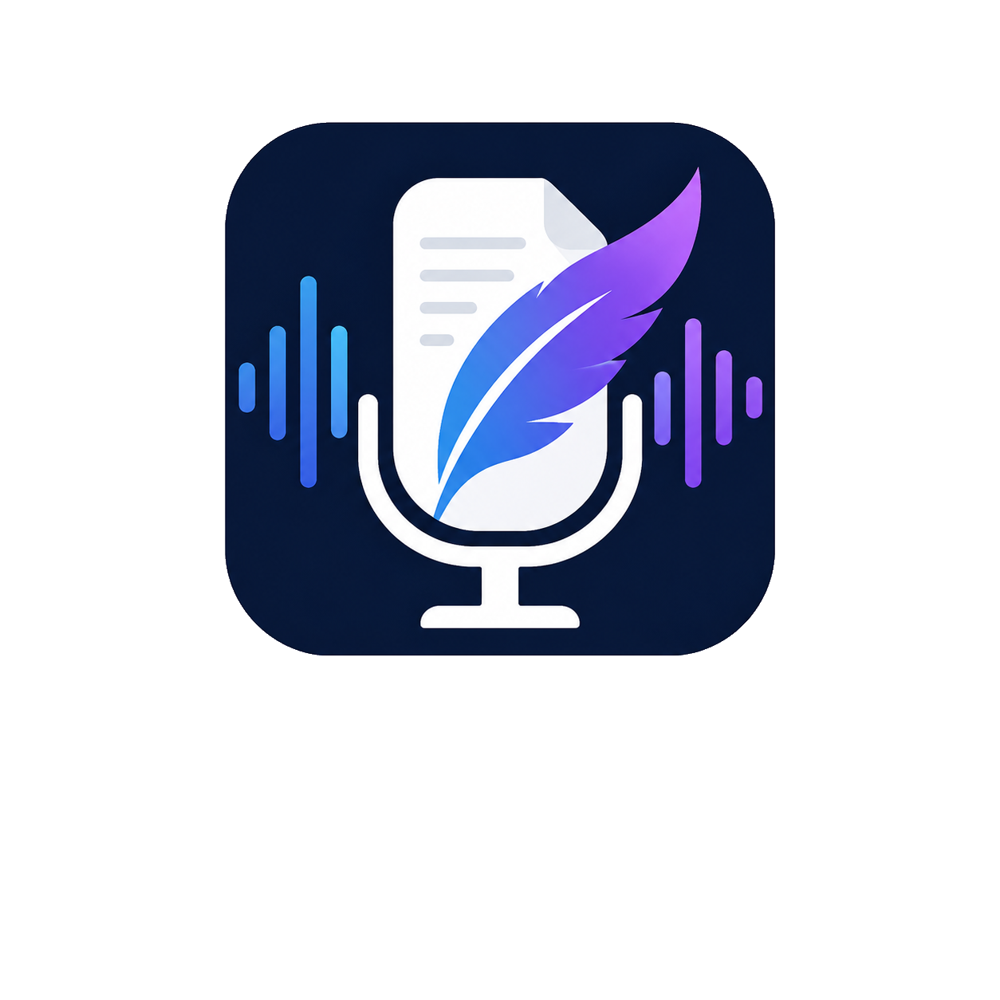

<p align="center">
  
</p>

# ScribeKit

[](https://github.com/quangshuynh/scribekit/actions/workflows/ci.yml)
[](https://swift.org)
[](https://www.apple.com/macos/)
[](LICENSE)

A native macOS app for background-first meeting transcription. ScribeKit runs
quietly while you work in other applications and writes timestamped Markdown
transcripts to a folder you choose, on your machine.

**Status: early development.** Audio capture from selected applications
works; transcription and transcript writing are not implemented yet.

## Philosophy

- **Local-first.** Transcription and storage happen on your Mac. No accounts,
  no cloud database, no telemetry, no analytics.
- **Raw transcripts are source material.** ScribeKit never silently rewrites a
  transcript with AI, summarisation, grammar cleanup or inferred substitutions.
  Any derived notes are explicitly requested, stored separately, and clearly
  marked as derived.
- **Honest about uncertainty.** Low-confidence transcription is surfaced for
  review rather than quietly smoothed over.
- **Never hidden.** Capture is always visible to the user.

## Currently implemented

- Meeting configuration screen: title, audio retention mode, save location.
- Discovery of running applications through ScreenCaptureKit, with selection of
  one or several of them as intended audio sources, and a manual Refresh.
- Audio capture from the selected applications, started and stopped explicitly,
  with the selection resolved against the applications running at that moment
  and a clear failure when one of them has quit. Capture reports the format and
  level it is actually receiving.
- A save folder chosen in the system open panel and remembered across launches
  with a security-scoped bookmark, with honest reporting when the folder has
  been moved, deleted or had its access revoked, and controls to replace or
  forget it.
- Remembered setup choices: the audio retention mode and the applications last
  selected, matched against a fresh discovery on each launch.
- Domain models for the session lifecycle, audio retention, capture sources and
  session metadata, with unit tests.
- Shared Xcode scheme and a macOS CI workflow that builds and runs unit tests.

Captured audio is measured and discarded: nothing is transcribed, and no
transcript, audio file or session directory is written. Choosing a save folder
only remembers the folder. The Start Meeting control is intentionally disabled,
because a meeting implies a transcript ScribeKit cannot yet produce.

Listing applications and capturing their audio require Screen & System Audio
Recording permission, which macOS asks for the first time ScribeKit looks for
sources. Without it the screen reports the missing permission instead of a list
or a capture.

## Planned

All of the following are *planned*, not available:

- Live transcription of captured audio.
- Meeting lifecycle with background operation and a menu bar presence.
- Timestamped Markdown transcripts with autosave and crash/session recovery.
- Transcript search and history.
- Post-meeting review of uncertain passages.
- Optional audio retention (none / raw / compressed).
- Optional derived notes that never modify the raw transcript.

## Audio retention modes

| Mode | Behaviour |
| --- | --- |
| No Audio File | Default. Only the transcript is kept; no audio touches disk. |
| Raw | Lossless audio kept alongside the transcript. Largest files. |
| Compressed | Lossy audio kept as a smaller reviewable record. |

## Efficiency goals

ScribeKit is intended for multi-hour meetings on battery: event-driven work
instead of polling, minimal timers, bounded and roughly stable memory over long
sessions, coalesced UI updates, batched persistence, no retained audio unless
enabled, and minimal work while the interface is hidden. No screen or video
processing.

## Requirements

- macOS 26 or later
- Xcode 26 or later

## Build

```bash
xcodebuild -project ScribeKit.xcodeproj -scheme ScribeKit -destination 'platform=macOS' build
```

Or open `ScribeKit.xcodeproj` in Xcode and run the `ScribeKit` scheme.

## Test

```bash
xcodebuild -project ScribeKit.xcodeproj -scheme ScribeKit -destination 'platform=macOS' test
```

Unit tests use [Swift Testing](https://developer.apple.com/documentation/testing).

## Architecture

```
ScribeKit/
  App/                    App entry point
  Capture/                Application source discovery and audio capture
  Features/MeetingSetup/  SwiftUI configuration screen and its state
  Models/                 Domain value types (no I/O)
  Persistence/            Save-location storage and session layout policy
ScribeKitTests/           Swift Testing unit tests
```

Domain models are plain value types with no capture, transcription or
persistence behaviour. Session lifecycle is a single `MeetingState` enum with
explicit transition rules, so contradictory states are unrepresentable.
Capture, speech, persistence and session coordination are separate layers
behind that model: source discovery sits behind the `CaptureSourceProviding`
protocol and capture behind `AudioCapturing`, and ScreenCaptureKit types are
adapted at those boundaries rather than reaching the UI. Audio buffers are
described on the capture system's own queue and never cross the main actor.
Save-location storage sits behind `SaveLocationPersisting`, so security-scoped
bookmark data never reaches the setup screen, and session directory naming is a
pure policy separate from any filesystem work.

A future session will be laid out as a directory named from its date and title,
holding `transcript.md` with ScribeKit's own metadata in a hidden `.scribekit`
subdirectory, so a transcript stays readable without this app.

## Roadmap

1. **Foundation** — domain models, configuration UI, tests, CI, docs.
2. **Application audio source discovery and selection**.
3. Durable save location and session configuration.
4. **Audio capture from the selected applications** *(current)*.
5. On-device transcription.
6. Timestamped Markdown persistence, autosave and recovery.
7. Background and menu bar operation.
8. Transcript history, search and uncertainty review.
9. Optional audio retention and, separately, derived notes.

## Known limitations

- No transcription, transcript writing or recovery yet. Captured audio is
  described and discarded; none of it is kept, played back or written anywhere.
- Start Meeting is a disabled placeholder; capture has its own controls.
- ScreenCaptureKit has no audio-only stream, so the capture filter names a
  display as well as the selected applications. No screen output is added, so
  no frame is delivered or processed, but the permission macOS asks for is the
  screen recording one.
- The captured set is fixed when capture starts. Changing the selection while
  capture is running does not change what is being captured; stop and start
  again.
- If a captured application quits mid-capture, ScreenCaptureKit keeps the
  stream alive and delivers silence for it. ScribeKit does not substitute
  another source, and the next start reports the application as unavailable.
- Only applications owning an ordinary on-screen window are listed, so a
  menu-bar-only or windowless application is not offered as a source.
- The application list is refreshed on appearance and on demand, not
  automatically as applications start and quit.
- Nothing is written to the chosen folder yet; ScribeKit only remembers it and
  checks it is still reachable at launch.
- Access to the folder is held only while it is being validated. A session-long
  lease arrives with the code that writes transcripts.
- A moved folder is followed only when macOS reports its bookmark as stale; a
  folder that was deleted, or whose disk is absent, has to be chosen again.
- CI runs build and unit tests only — no linting, formatting, coverage or UI tests.

## License

MIT — see [LICENSE](LICENSE).
