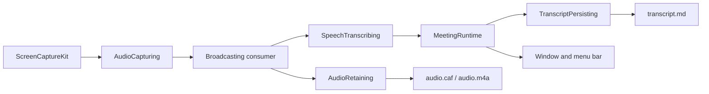

# Architecture

ScribeKit is Swift and SwiftUI, built on Apple platform frameworks. A
dependency is added only when the platform genuinely cannot do the job.

## Source layout

```
ScribeKit/
  App/                    App entry point
  Capture/                Application source discovery and audio capture
  Features/History/       SwiftUI history screen and its state
  Features/MeetingSetup/  SwiftUI configuration screen and its state
  Features/MenuBar/       Menu bar item and the state it presents
  History/                Reading past sessions back, and searching them
  Meeting/                The application-scoped active meeting and its runtime
  Models/                 Domain value types (no I/O)
  Persistence/            Save-location storage and session layout policy
  Transcription/          On-device speech recognition behind its own boundary
ScribeKitTests/           Swift Testing unit tests
```

## The shape of it



Domain models are plain value types with no capture, transcription or
persistence behaviour. Session lifecycle is a single `MeetingState` enum with
explicit transition rules, so contradictory states are unrepresentable.

Capture, speech, persistence and session coordination are separate layers
behind that model. Source discovery sits behind `CaptureSourceProviding`,
capture behind `AudioCapturing`, recognition behind `SpeechTranscribing`, and
ScreenCaptureKit and Speech types are adapted at those boundaries rather than
reaching the UI — so behaviour stays testable without system permission.

Save-location storage sits behind `SaveLocationPersisting`, so security-scoped
bookmark data never reaches the setup screen, and session directory naming is a
pure policy separate from any filesystem work.

## Ownership

The active meeting is owned by `MeetingRuntime`, created by the application
delegate and handed to both the window and the menu bar. Its lifetime is the
application's. What the setup screen owns is the configuration for the *next*
meeting; the running one holds a `MeetingSnapshot` taken when it started. See
[Meeting Lifecycle](meeting-lifecycle.md).

Both interfaces read one derived `MeetingRuntimeStatus` rather than tracking
the meeting separately, so the window and the menu bar cannot disagree.

## Reading versus writing

`HistoryStoring` is a read-only filesystem boundary with no method that
creates, replaces, appends to or deletes anything. `TranscriptDocument` reads a
written transcript back into its header fields and finalised spans,
`HistoryService` decides what counts as a meeting, and `TranscriptSearch` is a
pure matcher over what a load produced.

Recovery keeps its own store, because recording an interruption is a write and
History never writes. See
[Architecture Boundaries](../development/architecture-boundaries.md).
