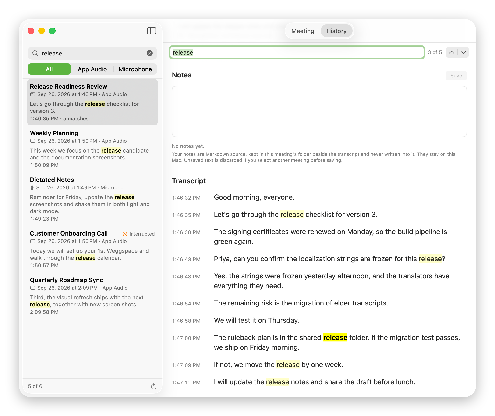

# History & Search

The History screen lists the meetings in your save folder — completed, failed,
interrupted, and the one running right now — newest first.

Each row leads with the meeting's title, with its date and capture mode below.
A row states its status only when the meeting did not end normally —
**Interrupted**, **Failed**, **In Progress** or **Legacy** — so those stand out
in a long list. Selecting one shows its details — status, times, sources,
recognition language, transcript size and whether a recording is beside it —
with Review, notes and a preview of its transcript, and reveals the transcript
or the recording in the Finder, or opens the transcript in whichever
application you use for Markdown.

## Search

Search is plain, case-insensitive substring matching over meeting titles,
recognised speech, captured application and microphone names, and the name of
each meeting's capture mode — `App Audio` or `Microphone`. A match in speech
shows a short excerpt of the passage, verbatim, with the match highlighted and
emphasised, and the transcript timestamp it came from.

Spaces are forgiving and punctuation is literal. Leading and trailing spaces
are ignored, several spaces match one, and a phrase that happens to be wrapped
onto two lines in the file still matches. Punctuation is matched as typed:
`deploy` finds `deployment,`, while `deployment?` finds only a question.

It is deterministic text matching, not semantic or AI search: no embeddings, no
vector database, no cloud service, and no index file written anywhere near your
transcripts. Consequently there is no fuzzy matching, no stemming and no
synonyms — a search for `closures` does not find `closure`, a misheard word is
found only by searching for what the recogniser actually wrote, and a phrase
split across two finalised spans is not matched.

Search does not match ScribeKit's own writing in a transcript — the header,
minute headings, gap markers, the interruption notice and the footer — so a
query for `Transcription gap` finds nothing. Titles and source names are
searched as metadata.

## Filtering by source

Under the search field, **All / App Audio / Microphone** narrows the list to
meetings from one capture mode. The filter and the search combine — `deployment`
with **Microphone** lists only Microphone meetings that mention it — and each is
kept when the other changes: clearing the search keeps the filter. The footer
counts what is shown, such as `3 of 41`.

Meetings from before Microphone transcription existed, including every v0.1.0
meeting, have no capture mode in their record; ScribeKit could capture only
application audio then, so they are listed as App Audio. A transcript with no
session record at all has no known mode and appears only under **All**.

There is no date filter. Newest-first order and search cover finding a recent
or a specific meeting without a second set of controls.

## Finding within a transcript

A meeting's details have a find field pinned at the top, which stays in view
while the transcript preview below scrolls. Type a phrase to see how many times it occurs; press Return or ⌘G for the next
match and ⇧⌘G for the previous one — both wrap around — and Escape to clear.
The current match is drawn in the system's find highlight and in bold, other
matches are tinted, and the preview scrolls to the current one.

The preview shows up to 50 passages at a time and moves to wherever the
current match is, so a match three hours into a meeting is reached without
laying out the whole transcript. In **Review**, **Show in Transcript** moves the
preview to a flagged passage the same way.

Finding reads the text History already loaded and changes nothing: the
highlight is drawn over the words, `transcript.md` is not opened, and nothing
is written. Transcription gaps and interruption notices are not yet a find
target — they are ScribeKit's structural remarks rather than speech, and the
preview does not show them.

## History never writes

Listing, previewing, refreshing and searching leave every transcript,
recording, session record and review sidecar byte-identical, including their
modification dates. The boundary is a type: the protocol History reads through
has no method that creates, replaces, appends to or deletes anything.

- A meeting whose session record is damaged, missing or written by a newer
  ScribeKit is reported as such and left exactly as it is, and never stops the
  rest of the folder from listing.
- A directory holding a ScribeKit transcript with no session record — written
  before session records existed — is listed as a legacy meeting with only the
  facts its transcript actually states. Markdown ScribeKit did not write is not
  listed as a meeting.
- A meeting that is running shows as **In Progress**, and its transcript is
  read as it grows. History cannot start or stop it.

## Scope and freshness

History lists the save folder you chose, one level deep. It does not search
your Mac for transcripts, does not follow a folder you moved a session out of,
and does not remember meetings from a folder you have since replaced.

It reads the folder when it opens, when you refresh, and when a meeting
finishes. There is no filesystem watcher, so a session added by something else
while History is open appears on the next refresh.

Whole transcripts are held in memory while History is open, so its cost grows
with the folder. Measured on this Mac in a debug build: 200 one-hour meetings —
48,000 spans, 7.9 MB of transcript — load in 0.82 s, for a 17 MB memory
increase. In an optimised build, the slowest search over a synthetic folder of
the same size took 20 ms per keystroke, and finding within one three-hour
transcript took under a millisecond; see
[Performance](../PERFORMANCE.md#interval-31-history-search-and-transcript-find).

There is no editor, no rename, no delete and no export. The files are yours to
manage in the Finder.
